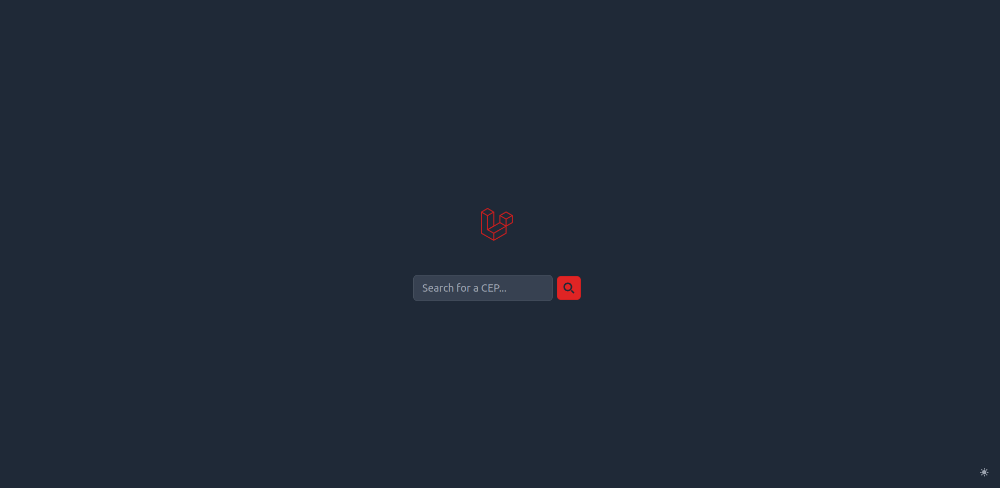
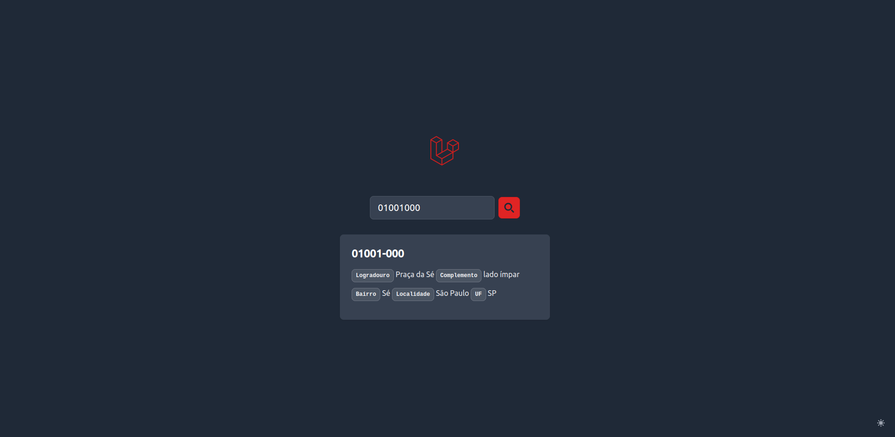
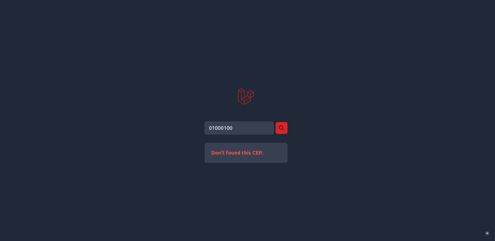

# About CEP Consulting
A application to found CEPs of Brazil, consulting [ViaCEP](https://viacep.com.br) API and storing in cache. Develop in [Laravel 11](https://laravel.com) using [Flowbite](https://flowbite.com) for UI.

## Requirements
1. PHP ^8.2
2. Composer ^2.7
3. Node ^22.5

## Installation

1. Clone this repository
    ```
    git clone https://github.com/VitorNuness/cep-consulting.git cep-consulting
    ```

2. Install dependencies
    ```
    composer install
    npm install
    ```

4. Copy environment variables
    ```
    cp .env.example .env
    ```

5. Generate the key application and run migrations:
    ```
    php artisan key:generate
    php artisan migrate
    ```

## Usage

### 1. UI
#### The home page.
This page show the result of CEP put in the search input.


#### Home page with result.
When the given CEP exists, can be see your data.


#### Home page with no result.
But, if the given CEP no exists, a message show.


### 2. API
- ```GET /api/{cep}```

    When given a valid CEP:
    ```
    {
        "cep": string,
        "logradouro": string,
        "complemento": string,
        "unidade": string,
        "bairro": string,
        "localidade": string,
        "uf": string,
        "ibge": string,
        "gia": string,
        "ddd": string,
        "siafi": string
    }
    ```

    When given a invalid CEP:
    ```
    {
        null
    }
    ```

##

This application is intended for personal studies using the third-party API.

Consult [ViaCEP](https://viacep.com.br) to more information.
